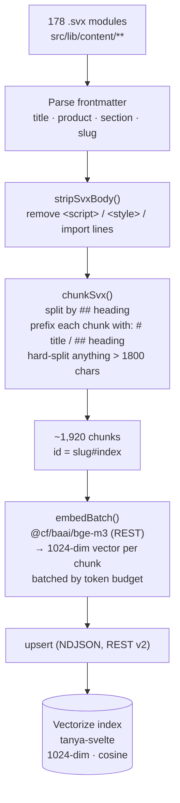
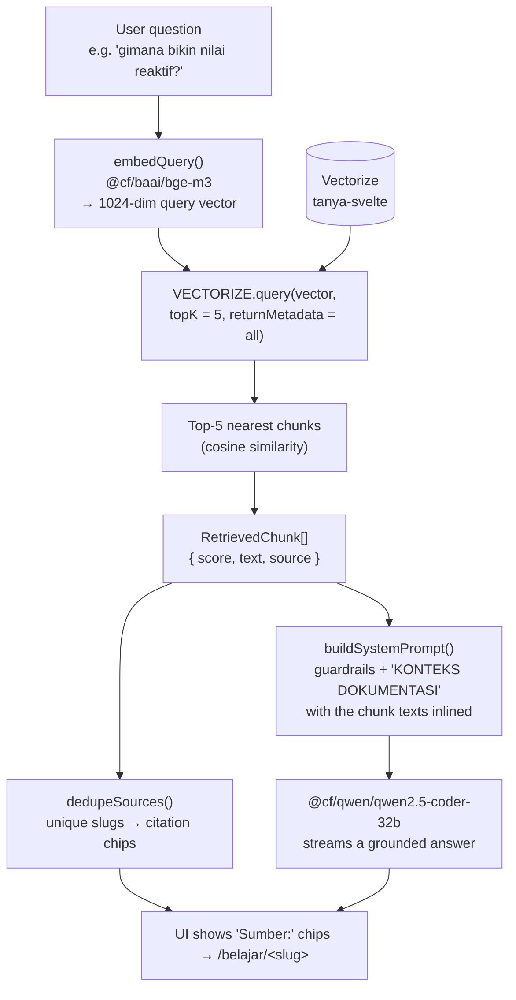

# Tanya Svelte — How the AI Gets Its Data (RAG)

The chatbot does **not** rely on the language model's memory for Svelte facts.
Instead it retrieves the answer from this site's own 178 modules and feeds those
exact passages to the model — a pattern called **RAG** (Retrieval-Augmented
Generation). This is what keeps answers accurate to *current* Svelte 5 even on a
small, free model.

There are two data paths:

1. **Write path (offline)** — turn the docs into a searchable vector index. Run once per content change with `npm run index`.
2. **Read path (per question)** — turn a question into a vector, find the closest doc chunks, and inject them into the prompt.

---

## 1. Write path — building the knowledge base



**What each step does**

| Step | Detail |
|------|--------|
| Parse | `scripts/index-content.mjs` walks every `.svx`, reads its frontmatter, derives the `slug` from the file path (`svelte/runes/state.svx` → `svelte/runes/state`). |
| Strip | Removes Svelte/mdsvex noise (`<script>`, `<style>`, `import` lines) so the embedding sees mostly prose + code. |
| Chunk | `chunkSvx()` splits each module at `##` headings and prefixes every chunk with `# <title>` and `## <heading>` so the chunk is self-describing. A single oversized block (e.g. a long code sample) is hard-split so no chunk blows the embedding model's 60k-token-per-request cap. |
| Embed | Each chunk's text is embedded with **`bge-m3`** (multilingual, 1024 dimensions) via the Workers AI REST API. |
| Store | Vectors are upserted into the **Vectorize** index `tanya-svelte`. The chunk's **text is stored in the vector's metadata**, so retrieval needs no second database lookup. |

**What one stored record looks like**

```jsonc
{
  "id": "svelte/runes/state#0",
  "values": [0.0123, -0.0481, /* … 1024 floats … */],
  "metadata": {
    "text":    "# $state\n## Apa itu\n$state membuat nilai jadi reaktif…",
    "slug":    "svelte/runes/state",
    "title":   "$state",
    "product": "svelte",
    "section": "runes"
  }
}
```

> **Free-tier math:** Vectorize free tier stores ~5,000,000 vector-dimensions
> ÷ 1024 ≈ **4,882 vectors**. The indexer caps chunk count and aborts if it
> would exceed a safe 4,500. Current corpus: **1,920 vectors** — well within.

---

## 2. Read path — answering one question



**Why this returns the *right* data**

- **Semantic, not keyword:** the question is converted to the *same* 1024-dim
  space as the docs, so meaning matches even when words don't. Vectorize returns
  the chunks whose vectors are closest by **cosine similarity**.
- **Cross-language:** `bge-m3` is multilingual, so an Indonesian question
  (*"bikin nilai reaktif"*) lands near the English-termed `$state` docs. This is
  exactly why we picked it over keyword search.
- **Grounding:** the retrieved chunk **texts** (carried in metadata) are pasted
  into the system prompt under `KONTEKS DOKUMENTASI`. The model is instructed to
  prefer that context — so it mostly *rephrases verified facts* rather than
  recalling from (stale) memory.
- **Citations are deterministic:** the `slug`/`title` of each retrieved chunk
  become the `Sumber:` chips — they come from retrieval metadata, not from the
  model, so they're always real links.

**The actual prompt the model receives (shape)**

```
SYSTEM:
  <guardrails: Svelte-5-first, prefer the docs, answer in Indonesian, …>
  [if on a lesson] Pengguna sedang membaca lesson "<title>" (<slug>).
  KONTEKS DOKUMENTASI:
  [1] (svelte/runes/state — $state)
  # $state … <chunk text> …

  [2] (svelte/runes/what-are-runes — What are runes?)
  …

MESSAGES:
  <prior user/assistant turns>  +  the new question
```

---

## Where each piece lives

| Concern | File |
|---------|------|
| Offline indexing | `scripts/index-content.mjs`, `scripts/lib/chunk.mjs` |
| Embed + vector search | `src/lib/server/ai/retrieval.ts` |
| Prompt assembly + source dedupe | `src/lib/server/ai/prompt.ts` |
| Orchestration (guards → retrieve → stream) | `src/lib/server/ai/handle-chat.ts` |
| Endpoint | `src/routes/api/chat/+server.ts` |
| Bindings (`AI`, `VECTORIZE`, `CHAT_KV`) | `wrangler.jsonc` |

> Re-run `npm run index` whenever lesson content changes, so the vectors stay in
> sync with the docs the chatbot cites.
